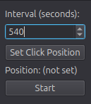

# Anti AFK Macro

A lightweight desktop utility for **Linux X11** that periodically performs a mouse click on another workspace while restoring your cursor position, helping prevent idle detection without interrupting your current workspace.



> **⚠️ This project is designed specifically for Linux running an X11 session.**
>
> It **does not support Windows, macOS, or Wayland**.

## Features

* Periodic automatic mouse clicks
* Adjustable click interval
* Capture a custom click position
* Automatically switches to the target workspace
* Restores your original workspace
* Restores your mouse cursor position
* Simple PyQt6 interface

## Requirements

### Operating System

* Linux
* **X11 desktop session**

This application uses **xdotool** to control the desktop, mouse, and virtual workspaces.

It will **not work** on:

* ❌ Windows
* ❌ macOS
* ❌ Wayland sessions

## Python Requirements

* Python 3.10 or newer (recommended)

Install the Python dependencies:

```bash
pip install -r requirements.txt
```

or

```bash
pip install PyQt6 pynput
```

### requirements.txt

```text
PyQt6
pynput
```

## System Dependency

This application requires **xdotool**.

### Ubuntu / Debian

```bash
sudo apt install xdotool
```

### Arch Linux

```bash
sudo pacman -S xdotool
```

### Fedora

```bash
sudo dnf install xdotool
```

## Installation

Clone the repository:

```bash
git clone https://github.com/USERNAME/REPOSITORY.git
cd REPOSITORY
```

(Optional) Create a virtual environment:

```bash
python3 -m venv .venv
source .venv/bin/activate
```

Install the Python dependencies:

```bash
pip install -r requirements.txt
```

Install `xdotool` using your distribution's package manager.

Run the application:

```bash
python main.py
```

## Usage

1. Launch the application.
2. Set the click interval in seconds.
3. Click **Set Click Position** and select the location to click.
4. Press **Start** to begin the macro.
5. Press **Stop** to stop the macro.

The application will periodically:

* Switch to the configured workspace.
* Perform the mouse click.
* Return to your original workspace.
* Restore your mouse cursor position.


## Project Structure

```text
.
├── main.py
├── ui.py
├── requirements.txt
└── assets/
```

## Notes

* This application relies on **xdotool**, which only functions in X11 sessions.
* The default workspace numbers are currently configured in the source code and can be adjusted if your desktop environment uses different workspace indices.
* The target click position can be left unset, in which case the macro clicks the center of the target workspace.

## License

This project is open source. Feel free to modify and distribute it under the terms of the license included with this repository.

## Disclaimer

This software is intended for automation and accessibility purposes. Users are responsible for ensuring they comply with the terms of service of any software or games in which they choose to use it.
